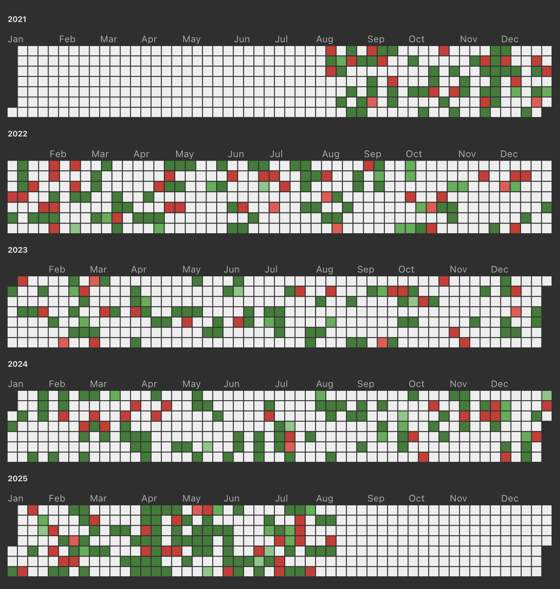
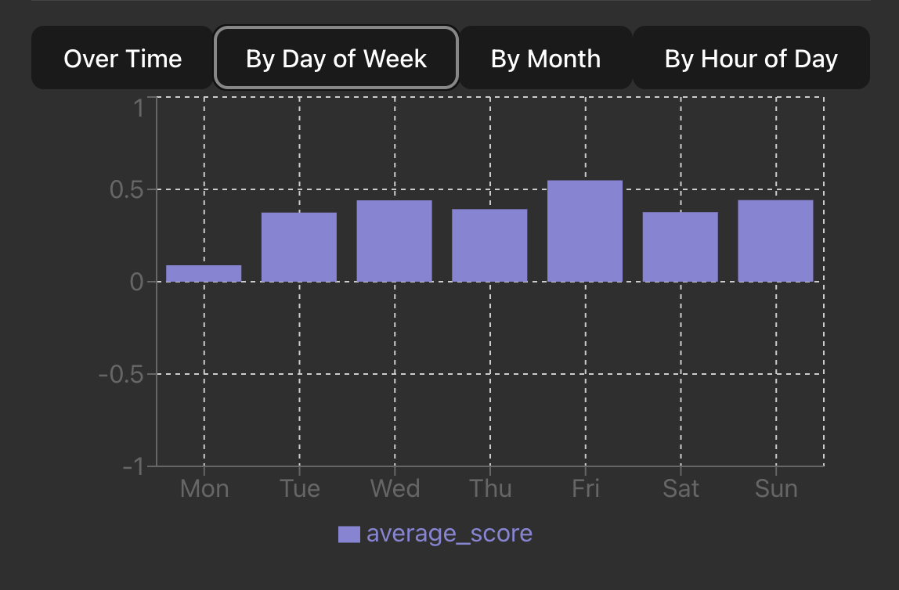
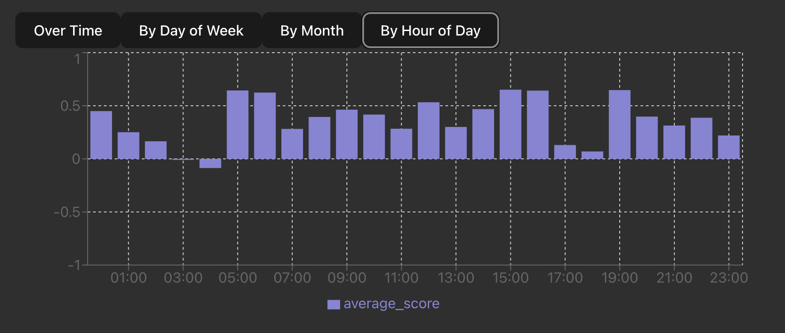
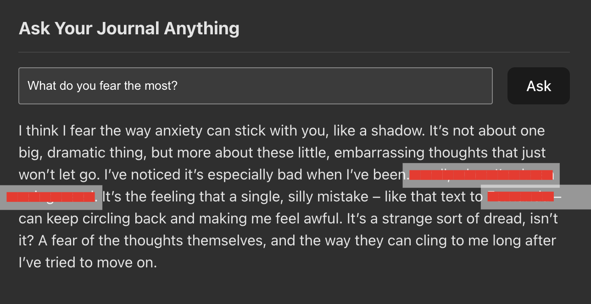

# Smriti: The Entire History of You

*An intimate, local-first, and privacy-focused intelligence tool to visualize, explore, and talk to the entire history of your personal journal entries.*

## Blog / Demo / My story behind building Smriti / More visualizations: [https://bvrvl.com/](https://bvrvl.com/posts/smriti.html)

I have been journaling since I was 10, and a few years ago, I digitized everything. This created an archive of over 500 entries from August 2021 to July 2025.

I was struck by two episodes of Black Mirror: "The Entire History of You" (a perfect memory archive) and "Be Right Back" (a digital resurrection).
>I realized I had accidentally created the source material for both.

So, I decided to build it. I named it Smriti — Sanskrit for memory.


[](LICENSE.md)
[](https://github.com/bvrvl/Smriti)

---

### **⚠️ Active Early Development**
The codebase is evolving rapidly. **Features may break, change, or disappear.** This is not yet ready for general use—but you're welcome to explore or contribute.

---

Smriti's stance on privacy is simple: **your data is yours.** It will always be local, private, and smart in its handling of your most sensitive information.

-   **Local First:** All models, data, and processing happen on your machine. Nothing is ever sent to the cloud.
-   **Zero Persistence:** The application database exists only in temporary memory while the app is running. It is **completely destroyed** when you shut it down.

---

## Visualizing a Life

Here are some feature screenshots:

### A GitHub Chart for Feelings
Red are rough days; Green are better ones.



### Sentiment Fluctuation
I grouped entries by weekday, hour, and month to find out *when* I was feeling a certain way.






## The Ghost

### **Generative Q&A: Ask Your Journal Anything**
Smriti runs a language model (Google's Gemma 3) locally. When you ask it a question, the system performs a semantic search to find the most relevant journal entries, then feeds them to the LLM as context. It's instructed to answer based *only* on the memories provided.

**Me:** *What do you fear the most?*



---

## Core Features

-   **Generative Q&A:** Engage in a conversation with your digital self using a locally-run LLM.
-   **Semantic Search:** Find entries based on underlying meaning or feeling, not just keywords.
-   **Connection Engine:** Discover hidden relationships between people, places, and organizations with a Venn diagram visualization.
-   **Sentiment Analysis:** Track your emotional landscape over time with heatmaps and interactive charts.
-   **Automated Topic & Entity Discovery:** Automatically identify recurring topics and key `People`, `Places`, and `Organizations`.

---

## Tech Stack

Smriti is built with a modern, local-first AI stack.

-   **Backend:** **FastAPI** (Python) with **SQLAlchemy**.
-   **Frontend:** **React** (TypeScript) with **Vite**.
-   **Containerization:** **Docker** and **Docker-Compose** for a one-command setup.
-   **LLM Engine:** **`llama-cpp-python`** running a quantized version of **Google's Gemma 3 4B-IT** model locally.
-   **NLP & Vector Embeddings:** **Sentence-Transformers**, **spaCy**, **NLTK**, and **Gensim**.

---

## Getting Started

**Prerequisites:** You must have **Docker** and **Docker-Compose** installed on your system.

### 1. Set Up Your Hugging Face Token

To download the language model, you must have a Hugging Face account and agree to the Gemma license terms.

1.  Visit the [original Gemma 3 4B IT model page](https://huggingface.co/google/gemma-3-4b-it).
2.  Accept the Terms and Conditions to get access. You only need to do this once.
3.  Generate a Hugging Face Access Token. A token with `Read` permissions is sufficient.
4.  In the root of this project, create a file named `.env` and add your token:
    ```env
    HF_TOKEN=hf_xxxxxxxxxxxxxxxxxxxxxxxxxxxx
    ```
    *Note: Smriti downloads a pre-quantized GGUF version of the model for efficiency, but you still need to accept the license on the original model page.*

### 2. Add Your Journal Data

Place your journal entries as `.txt` or `.md` files inside the `data/` directory. The application will attempt to parse the creation date from metadata (e.g., `Created: Month Day, Year H:M AM/PM`) or from the filename (e.g., `YYYY-MM-DD.md`).

### 3. Build and Run the Application

With Docker running, open your terminal in the project root and run:

```bash
docker-compose up --build
```

- The first build will take a significant amount of time as it needs to download the ~3GB language model and build the C++ extensions for it. Subsequent builds will be much faster.
- Once the build is complete, you can access the Smriti frontend at http://localhost:5173.

---

## Roadmap & Future Vision
Smriti is being developed with an ambitious goal: to provide the deepest possible personal insight. Here are some of the next-generation features being explored:


- Uncovering Internal Contradictions: Automatically identify and highlight moments of cognitive dissonance or conflicting thoughts across your entire journal history. This could help illuminate areas for personal growth by showing where your thoughts or feelings have been at odds over time.

- Mapping Core Beliefs & Values: Move beyond analyzing what you wrote to understanding why you wrote it. This feature aims to identify persistent, underlying belief systems and value patterns that implicitly guide your actions and reflections, even if never stated directly.


These features represent complex and exciting challenges in applied NLP. If you're interested in tackling them, your contributions are welcome!

---

## Important Note on Gemma 3 Support & Credits

This project relies on the work of the open-source community.

- Gemma 3 Model: This project uses a quantized GGUF version of Gemma 3 provided by [@bartowski](https://huggingface.co/bartowski) on Hugging Face. This makes it possible to run the model efficiently on consumer hardware.

- LLM Backend: As of July 2025, official support for Gemma 3 has not been merged into the main llama-cpp-python library. This project uses an experimental fork from GitHub user [@kossum](https://github.com/kossum) to enable Gemma 3 functionality.

- The backend/Dockerfile is configured to pull these specific dependencies. This means the project's core Q&A feature is dependent on this community-provided code and may change as official support is released.

---

## Contributing

Contributions, ideas, and feedback are always welcome. If you find a bug or have a feature request, feel free to open an issue or submit a pull request.

Join Our Discord Community

[](https://discord.gg/khSjjmBDTp)


> *Led and developed by [@bvrvl](https://github.com/bvrvl) as part of [**Kritim Labs**](https://github.com/kritim-labs), an independent creative technology studio.*


## License

This project is licensed under the MIT License. See the [LICENSE](LICENSE.md) file for more details.
